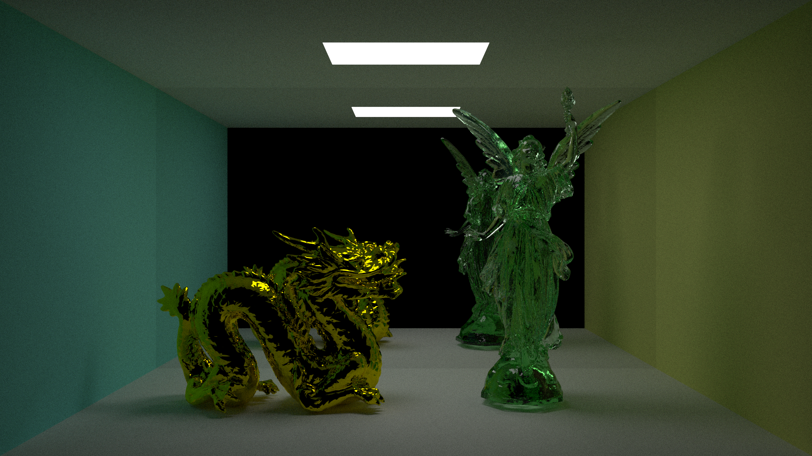
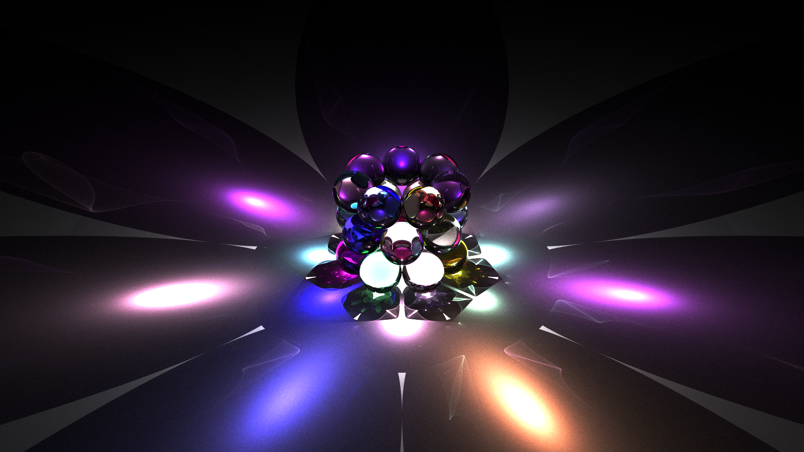
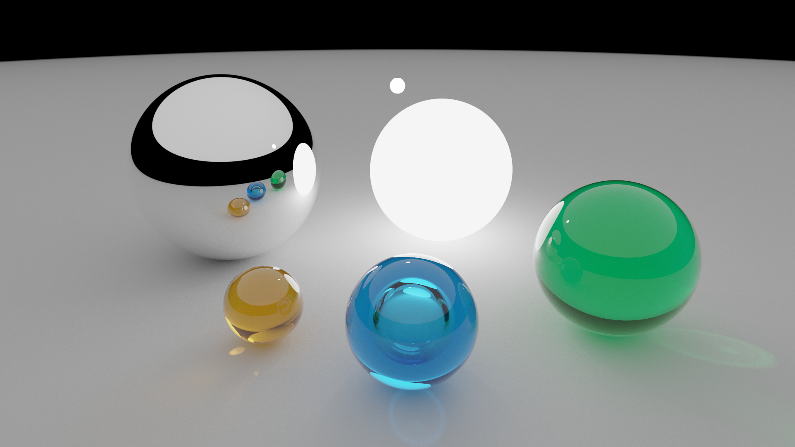
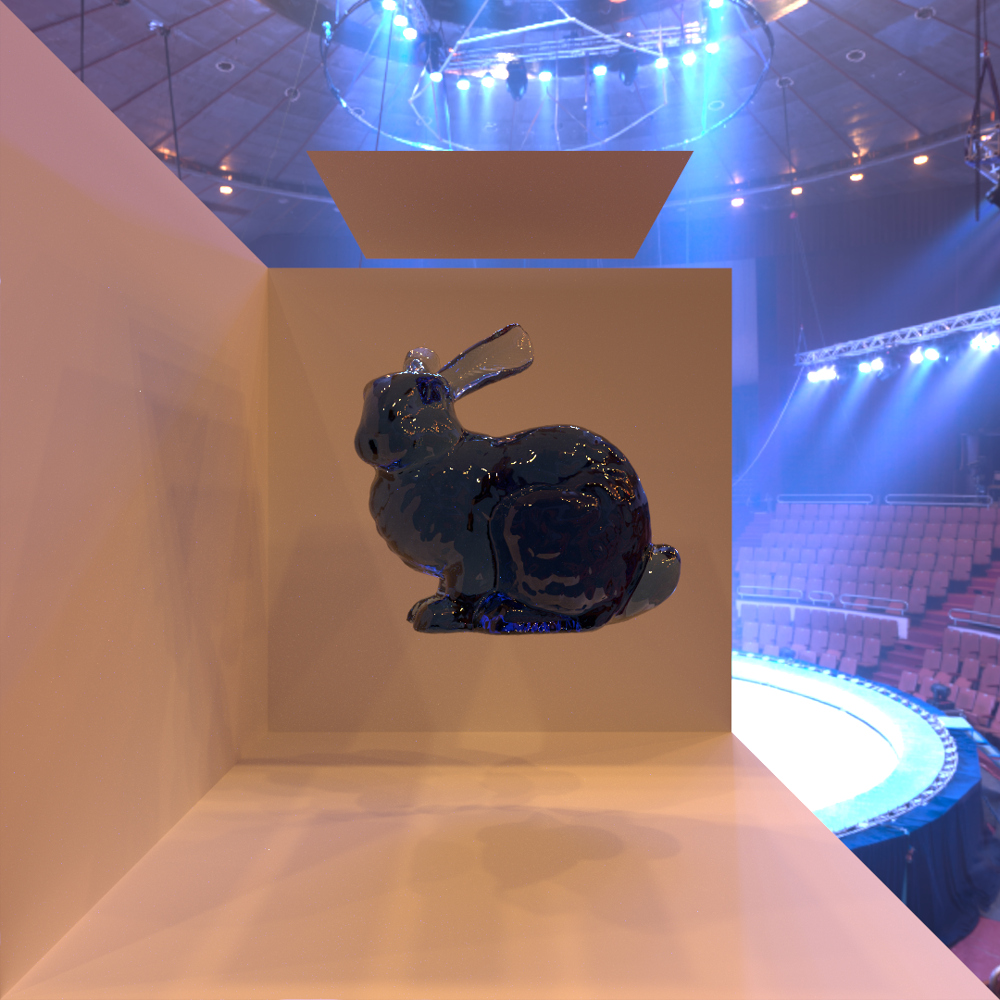

# Small Portfolio
This repository attemps to showcase raytracing programs written in C as well as (very small) Python and Type Script programs for my portfolio.

As a disclaimer, Please note that the raytracing programs are not written or structured in the form readable by a third-party.
## Implementing Raytracing Algorithms in C
We have implemented monte carlo raytracing techniques along with miscellaneous algorithms such as psudo random number generator and spatial acceleration data structure in C.

Below are the images rendered using our raytracer.

### Theories of Raytracing
Our raytracer is based on the theoretical definition and formulation of light transport problems as well as statistical solutions using monte carlo integration developed by people in the field.

http://graphics.stanford.edu/papers/veach_thesis/

https://www.pbr-book.org/3ed-2018/contents
### Implemented Algorithms
- Vertex Connection and Merging

Our raytracer implements a robust algorithm to handle difficult lighting scenario by combining vertex connection and density estimation techniques in a unified way using multiple importance sampling scheme.

https://cgg.mff.cuni.cz/~jaroslav/papers/2012-vcm/

Documents below describe vertex connection and desnsity estimation methods, respectively.

https://graphics.stanford.edu/courses/cs348b-03/papers/veach-chapter10.pdf

http://graphics.ucsd.edu/~henrik/papers/progressive_photon_mapping/progressive_photon_mapping.pdf

- Construction and Traversal of Bonding Volume Hierarchy Using Surface Area Heuristics

Our raytracer implements Bounding Volume Hierarchy (BVH), A spatial data structure to accelerate ray traversal.

https://www.sci.utah.edu/~wald/Publications/2007/ParallelBVHBuild/fastbuild.pdf

https://research.nvidia.com/sites/default/files/pubs/2013-09_On-Quality-Metrics/aila2013hpg_paper.pdf

- Construction and Traversal of kd-tree

Our raytracer implements kd-tree, A spatial data structure to accelerate neighbor search for density estimation.

- Psuedo Random Number Generator

Our raytracer implements xoroshiro128+, A psuedo random number generator (PRNG).

https://prng.di.unimi.it/
